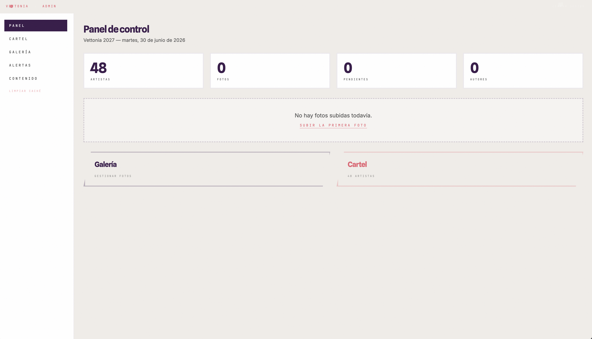
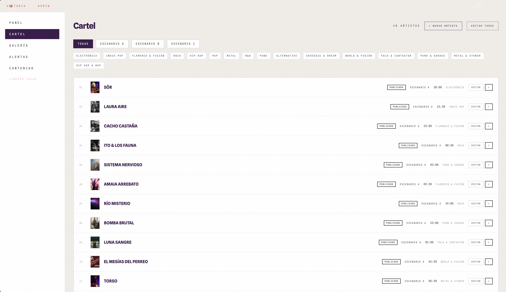
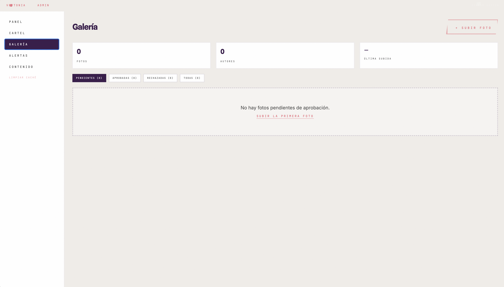
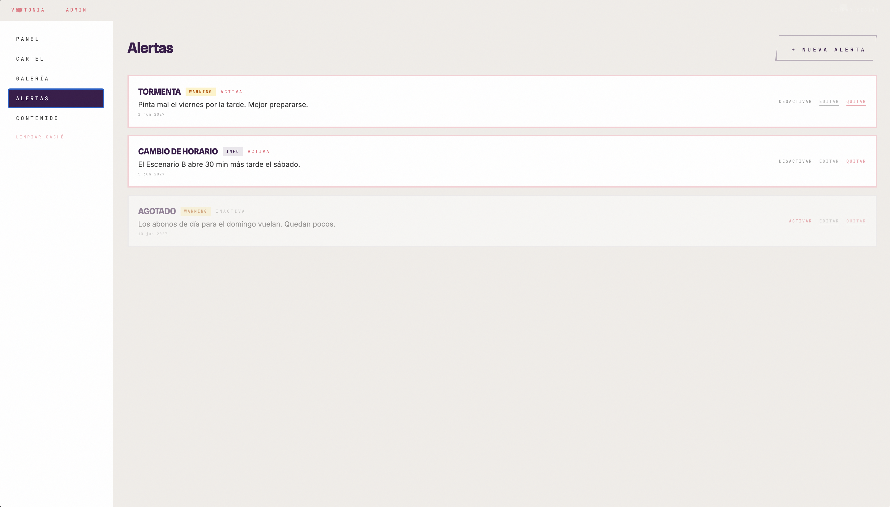
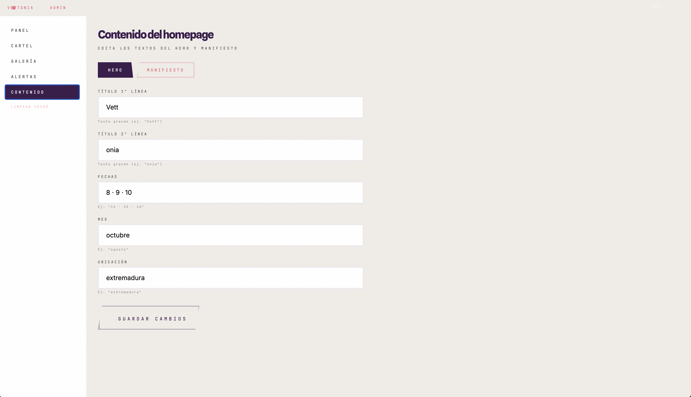

<p align="center">
  
</p>

<h1 align="center">🏕️ Vettonia 2027</h1>

<p align="center">
  <a href="https://vettonia.netlify.app">🌐 vettonia.netlify.app</a> ·
   ·
   ·
   ·
   ·
   ·
  
</p>

<p align="center">
  <b>Progressive Web App</b> para un festival de música en Extremadura.<br>
  47 artistas, 3 escenarios, pase digital, galería colaborativa y panel de administración.<br>
  8 · 9 · 10 de octubre de 2027.
</p>

---

## 🖼️ Capturas

### App público

<table>
  <tr>
    <td></td>
    <td></td>
  </tr>
  <tr>
    <td align="center"><b>Cartel con 3 escenarios</b></td>
    <td align="center"><b>Ficha individual de artista</b></td>
  </tr>
  <tr>
    <td></td>
    <td></td>
  </tr>
  <tr>
    <td align="center"><b>Pase digital con QR</b></td>
    <td align="center"><b>Mapa interactivo del recinto</b></td>
  </tr>
  <tr>
    <td></td>
    <td></td>
  </tr>
  <tr>
    <td align="center"><b>Galería colaborativa</b></td>
    <td align="center"><b>Página 404 personalizada</b></td>
  </tr>
</table>

### Panel de administración

<table>
  <tr>
    <td></td>
    <td></td>
  </tr>
  <tr>
    <td align="center"><b>Dashboard con estadísticas</b></td>
    <td align="center"><b>CRUD de artistas</b></td>
  </tr>
  <tr>
    <td></td>
    <td></td>
  </tr>
  <tr>
    <td align="center"><b>Moderación de galería</b></td>
    <td align="center"><b>Publicación de alertas</b></td>
  </tr>
  <tr>
    <td></td>
    <td></td>
  </tr>
  <tr>
    <td align="center"><b>Editor de contenido del homepage</b></td>
    <td></td>
  </tr>
</table>

---

## 🎯 Qué hace

**Para el asistente:**
- Cartel con 47 artistas en 3 escenarios (A, B, C) con horarios y estilos
- Fichas individuales con biografía, foto, enlaces y avance de canción
- Mapa interactivo con escenarios, acampada, parking y puntos de interés
- Pase digital personalizado con foto, nombre, QR y rol
- Galería colaborativa de fotos con autenticación por PIN
- Muro de mensajes en tiempo real
- Favoritos y recordatorios de conciertos
- Encuestas en vivo y logros
- Live Ticker con noticias en portada
- Funciona offline (PWA instalable)

**Para la organización (panel admin):**

El panel de administración está protegido con Supabase Auth (email + contraseña) y ofrece 5 secciones:

- **Dashboard** (`/admin`) — Resumen con estadísticas: pases activos, fotos subidas, mensajes enviados y artistas favoritos. Cada tarjeta consulta su servicio y se actualiza al cargar la página.
- **Gestión de artistas** (`/admin/lineup`) — CRUD completo: crear, editar y eliminar artistas del cartel. Incluye un botón "Sincronizar" para volcar los datos estáticos a Supabase.
- **Moderación de galería** (`/admin/gallery`) — Lista de fotos con estado pending/approved/rejected. Las fotos pendientes no se muestran en la galería pública hasta que se aprueban. Se puede incluir un motivo de rechazo.
- **Alertas** (`/admin/alerts`) — Publicar notificaciones que aparecen en el Live Ticker (portada) y como banner superior en todas las páginas.
- **Editor de contenido** (`/admin/content`) — Editor de textos del homepage (títulos del Hero, fechas, manifiesto). Los cambios se guardan en Supabase y se reflejan al instante. Si no hay conexión, se usa localStorage como respaldo.

---

## 🏗️ Cómo está construido

```
src/
├── pages/       → 12 rutas públicas + 5 admin + NotFound
├── sections/    → 9 secciones de la portada
├── components/  → 22 componentes reutilizables
├── services/    → 17 módulos de lógica de negocio
├── hooks/       → Hooks personalizados
├── lib/         → Utilidades (persistencia, imágenes, Supabase)
├── types/       → Interfaces de dominio
├── data/        → 47 artistas del cartel
└── constants/   → Temas, colores, selección de avances
```

**Lo que importa de la arquitectura:**
- La lógica de negocio está separada de la interfaz (capa de servicios)
- Los componentes no saben si los datos vienen de Supabase o de localStorage
- Las rutas se cargan bajo demanda (lazy loading)
- Tipo estricto con TypeScript: cambiar una interfaz y el compilador te dice qué se rompe
- El PIN se hashea con SHA-256 antes de almacenarse, nunca en texto plano

**Por qué SPA y no SSR:** El contenido del festival es estático (no cambia cada minuto). El SEO se cubre con meta tags inyectados y sitemap. Next.js habría añadido complejidad sin beneficio real para este caso.

**Por qué Supabase y no Firebase:** Postgres real con SQL, RLS policies para seguridad, Realtime nativo, código abierto sin vendor lock-in. Misma funcionalidad que Firebase pero con un modelo de datos más sólido.

---

## 🧪 Testing

257 pruebas distribuidas en 69 archivos. Cada vez que tocas código, las pruebas verifican que no se ha roto nada.

- **Servicios:** auth, album, pass, messages, stats, alerts, lineup, reactions, favorites, polls, achievements, content, qr, env, supabase
- **Componentes:** renderizado, estados vacío/error/carga, interacciones de usuario
- **Páginas:** navegación, integración con servicios, flujos completos
- **Hooks:** estado y efectos secundarios

Los tests buscan comportamientos, no implementación. Si cambias Tailwind por CSS Modules, los tests siguen pasando.

---

## 🚀 Stack

| Capa | Tecnología |
|------|-----------|
| Framework | React 19 |
| Lenguaje | TypeScript 5 (strict) |
| Bundler | Vite 8 |
| Estilos | Tailwind CSS 4 |
| Animaciones | Framer Motion 12 |
| Backend | Supabase (Postgres, Auth, Storage, Realtime) |
| Mapas | Leaflet + React Leaflet |
| Testing | Vitest + Testing Library (257 tests) |
| PWA | vite-plugin-pwa + Workbox |
| SEO | react-helmet-async + JSON-LD |
| Imágenes | imagemin + canvas compression |

---

## 🔐 Seguridad

- **PIN hasheado con SHA-256** antes de almacenar en localStorage o Supabase
- **Autenticación obligatoria con PIN** en galería (no hay ruta alternativa)
- **console.warn contextual** en todos los catch blocks para depuración
- **Validación de Clipboard API** antes de escribir al portapapeles
- **Entorno aislado:** variables sensibles en `.env`, ignorado por git

---

## 📲 PWA

La app es instalable en el móvil como una app nativa:
- Service Worker con precaching de assets y runtime caching de imágenes
- Página offline personalizada
- Manifest con iconos 192/512 y tema morado (#3a1a4a)
- Sitemap con 47 URLs de artistas

---

## 🌐 En vivo

[https://vettonia.netlify.app](https://vettonia.netlify.app)

---

## 📄 Lo que representa

Vettonia no es un ejercicio ni un proyecto de tutorial. Es una aplicación real construida desde cero con decisiones técnicas pensadas, no impuestas por una guía.

77 commits, 257 tests, 0 dependencias innecesarias. Una muestra de cómo me gusta trabajar: código ordenado, funcional, testeado y que hace lo que tiene que hacer.
